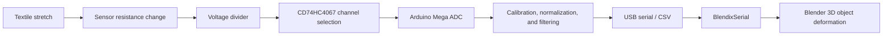

# HEXA-S · Smart Textile Stretch Data Visualization Module

[English Tutorial](README.md) | [中文教程](README.zh.md)

**Adaptive Smart Textile Care**

HEXA-S is a smart-textile data visualization prototype. Stretch sensors sewn or embroidered into the textile change resistance as the material deforms. An Arduino reads each sensing point through voltage-divider circuits and an analog multiplexer, then sends the data to Blender over USB serial. Objects in the Blender scene deform in real time to visualize relative stretch across different areas of the textile.

> [!IMPORTANT]
> This project is a research and design prototype. Uncalibrated conductive thread or stretch sensors indicate relative deformation trends only. Their output must not be interpreted directly as an accurate residual-limb volume, pressure measurement, or clinical diagnosis. Medical use requires independent sensor calibration, repeatability studies, risk assessment, and regulatory validation.

## 1. System, Hardware, and Languages

### Software Environment

| Item | Description |
| --- | --- |
| Development computer | Windows 10 |
| Embedded development | Arduino IDE with Arduino AVR Boards |
| Controller | Arduino Mega 2560 |
| 3D visualization | Blender; Blender 4.2 or later is recommended for the current extension installation workflow |
| Serial interface | [blendixserial Blender extension](https://electronicstree.com/blendixserial-addon/) |
| Firmware language | Arduino C/C++ |
| Blender extension language | Python |
| Data format | BlendixSerial CSV Fixed at 115200 baud |

The starter firmware in this repository generates the documented BlendixSerial CSV format directly, so it does not require an Arduino-side library. Projects that need the binary protocol or bidirectional communication can use the official [blendixserial-arduino](https://github.com/electronicstree/blendixserial-arduino) library and select the matching Data Format in Blender.

### Hardware List

| Hardware | Quantity | Purpose |
| --- | ---: | --- |
| Arduino Mega 2560 | 1 | Reads sensors and sends serial data |
| CD74HC4067 16-channel analog multiplexer | 1 | Reads multiple sensors through one analog input |
| Stretch sensors or conductive-thread sensing elements | 6 or more | Detect textile extension and recovery |
| Fixed resistors | 1 per channel | Form voltage dividers with the sensors |
| Breadboard or solderable prototyping board | 1 | Prototype or secure the circuit |
| USB data cable | 1 | Firmware upload, power, and serial communication |
| Jumper wires, leads, and strain-relief parts | As required | Electrical connection and mechanical protection |
| Textile substrate and conductive/embroidery thread | Design dependent | Build the wearable sensing structure |

Do not copy the fixed-resistor value from a concept diagram. Measure each sensor with a multimeter at rest and at its intended maximum extension. Select a resistor in the same order of magnitude as the middle of that working range, then validate the resulting ADC range.

## 2. Architecture and Features



### Starter Implementation

- Polls six CD74HC4067 sensor channels; the code can be extended to all 16 channels.
- Averages several ADC samples and applies an exponential moving average to reduce jitter.
- Normalizes every channel to `0.0–1.0` using its own measured minimum and maximum.
- Converts each channel into the Scale Z value of one Blender object and updates at approximately 20 Hz.
- Includes a raw ADC output mode for collecting calibration values.

### Repository Structure

```text
HEXA-S/
├── README.md
├── README.zh.md
└── firmware/
    └── hexa_s_visualizer/
        └── hexa_s_visualizer.ino
```

Project-specific `.blend` files, textile patterns, calibration records, and circuit diagrams can be placed in `blender/`, `textile/`, `calibration/`, and `docs/`. Check the license before uploading third-party Blender models, extensions, images, or other assets.

## 3. Hardware Connection and Assembly

### Arduino Mega to CD74HC4067

| CD74HC4067 | Arduino Mega | Description |
| --- | --- | --- |
| VCC | 5V | Multiplexer supply; confirm the voltage rating of the actual module |
| GND | GND | Common ground |
| S0 | D2 | Channel-select bit 0 |
| S1 | D3 | Channel-select bit 1 |
| S2 | D4 | Channel-select bit 2 |
| S3 | D5 | Channel-select bit 3 |
| SIG / COM | A0 | Arduino analog input |
| EN | GND | Active-low enable; connect to a digital pin instead if software control is required |

### Sensor Channel

```text
5V ── stretch sensor ──●── fixed resistor ── GND
                        │
                    CD74HC4067 Cn
```

`Cn` is one of `C0–C15`. Swapping the sensor and fixed resistor reverses the direction of the ADC response. Set the corresponding entry in the firmware's `INVERT[]` array when a channel changes in the opposite direction.

### Assembly Sequence

1. With power disconnected, build one sensor and one voltage divider on a breadboard.
2. Check for a short between 5V and GND. Power the board and verify that the A0 reading changes when the sensor is stretched.
3. Connect the CD74HC4067 and validate `C0` before adding the remaining channels one at a time.
4. Attach the sensing elements to the intended textile areas. Add strain relief where flexible textile meets rigid wire so tension is not concentrated at solder joints.
5. Secure the wiring while preserving the intended movement of the textile. Keep conductive paths from touching one another.
6. Connect USB only after the wiring has been inspected, then calibrate every channel and test the Blender mapping.

## 4. Firmware Upload and Sensor Calibration

### 4.1 Upload the Firmware

1. Install the [Arduino IDE](https://www.arduino.cc/en/software).
2. Open `firmware/hexa_s_visualizer/hexa_s_visualizer.ino`.
3. Under **Tools → Board**, choose **Arduino Mega or Mega 2560** and select the **ATmega2560** processor.
4. Connect the board with a USB data cable. Find its port in Windows Device Manager and select the same `COM` port under **Tools → Port**.
5. Check the pin constants, `SENSOR_COUNT`, and baud rate at the top of the sketch, then click **Upload**.

### 4.2 Calibrate Every Channel

1. Change `CALIBRATION_MODE` to `true` and upload the firmware again.
2. Open Arduino Serial Monitor at `115200 baud`.
3. Record stable readings for every channel with the textile at rest. Repeat at the largest extension allowed by the design.
4. Add a small margin and enter the results in `CAL_MIN[]` and `CAL_MAX[]`. If the normalized direction is reversed, set that channel's `INVERT[]` entry to `true`.
5. Change `CALIBRATION_MODE` back to `false` and upload again.
6. Close Serial Monitor. Blender and Serial Monitor normally cannot use the same COM port simultaneously.

The textile, mounting method, temperature, humidity, and repeated loading can all cause baseline drift. Keep a separate calibration record for each sample and recalibrate after resewing or replacing a sensing element.

## 5. Blender Tutorial

### 5.1 Install BlendixSerial

1. Download the ZIP package from the [BlendixSerial extension page](https://electronicstree.com/blendixserial-addon/).
2. In Blender, open **Edit → Preferences → Get Extensions**.
3. Open the menu in the upper-right corner, choose **Install from Disk**, and select the ZIP file.
4. Return to the 3D Viewport, press `N`, and open the **blendixserial** tab.

### 5.2 Build a Six-Channel Visualization

1. Create or import six Blender objects in the same order as textile sensing points `C0–C5`.
2. For each required object, use **Object → Apply → Scale** so the initial scale is `1, 1, 1`.
3. In the BlendixSerial connection panel, select the Arduino `COM` port, set Baud Rate to `115200`, and click **Connect**.
4. Set Mode to **Receive** and Data Format to **CSV (Fixed)**.
5. Use **Add Object** to add the six objects in `C0–C5` order. Enable only **Scale Z** in each object's receive settings.
6. Choose an Update Scene interval suitable for the computer, then click **Start**. Stretching an area of the textile should change the Z scale of its mapped 3D object.

The BlendixSerial documentation does not specify a hard object limit, but its published testing covers 10 objects. When increasing the system to 16 or more sensing points, add objects gradually while monitoring latency, dropped updates, and CPU use. Reduce `FRAME_RATE_HZ`, increase the Update Scene interval, or simplify the Blender scene when necessary.

## 6. Serial Data Mapping

The firmware writes nine values per sensor in the BlendixSerial CSV Fixed layout:

```text
Location X, Location Y, Location Z,
Rotation X, Rotation Y, Rotation Z,
Scale X,    Scale Y,    Scale Z
```

This implementation changes only the ninth value, `Scale Z`. Transform blocks for multiple objects are concatenated in the same order as the Receive object list, and the frame ends with a semicolon and newline.

```text
# One-object example: Scale Z = 1.375
0,0,0,0,0,0,1,1,1.375;
```

The Blender object order, sensor channel order, and physical textile locations must share one mapping. A future `calibration/channel-map.csv` should record the channel, physical position, sensor identifier, and calibration values.

## 7. Functional Validation

| Test | Expected result |
| --- | --- |
| Stretch one channel | Only the corresponding Blender object changes significantly |
| Return to rest | The object approaches its initial scale without large persistent drift |
| Stretch several regions | Multiple objects update independently without channel swaps |
| Run continuously for 10 minutes | Serial communication remains active and latency does not continuously accumulate |
| Disconnect USB | Blender stops updating and can recover after reconnecting |
| Repeat the same movement | The overall response is similar; differences are recorded and investigated |

## 8. Troubleshooting

| Problem | Checks |
| --- | --- |
| COM port is missing | Confirm that the USB cable supports data, the driver is installed, and Device Manager recognizes the board |
| Blender cannot connect | Close Arduino Serial Monitor and verify the COM port and baud rate |
| Objects do not move | Confirm Receive mode, CSV Fixed format, Start state, and Scale Z selection |
| Channel order is wrong | Compare `C0–C5`, `SENSOR_COUNT`, and the Blender receive-object order |
| Readings are noisy | Check common ground, solder joints, long-wire interference, sample count, and filter settings |
| Reading remains at 0 or 1023 | Check the divider, open/shorted sensor, and fixed-resistor choice |
| Stretch direction is reversed | Change the corresponding `INVERT[]` entry |
| Visualization stutters | Lower the firmware frame rate, increase Update Scene delay, or reduce object count and mesh complexity |

## 9. References and Acknowledgments

- [Arduino Project | 3D Temperature Gauge with Blender and Arduino](https://www.youtube.com/watch?v=f5dibcekHPs&list=PLNgvH2WAd8PjuhDG4desShaxqB3BjRXQl): reference demonstration for sending Arduino sensor data into Blender.
- [BlendixSerial Blender Add-on](https://electronicstree.com/blendixserial-addon/): installation, connection panel, send/receive modes, and communication-format documentation.
- [blendixserial-arduino](https://github.com/electronicstree/blendixserial-arduino): optional Arduino-side serial communication library.

This project applies the general Arduino-to-Blender serial visualization method to a multi-channel smart-textile prototype. HEXA-S textile geometry, channel mapping, calibration data, and 3D representation should be documented separately as original project work.

## License

Add a `LICENSE` file to the repository after selecting an open-source license for HEXA-S. The BlendixSerial Arduino library is distributed under GPL-3.0; copied or modified upstream code must comply with that license and retain attribution. The included starter firmware writes CSV directly and does not contain a copy of the upstream library, but the BlendixSerial protocol and tutorial should still be credited.
