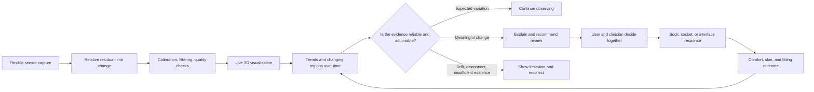

[English](README.md) | [中文](README.zh.md)

# HEXA-S

## A smart-textile system that turns residual-limb change into fitting evidence

HEXA-S connects flexible stretch sensors, wearable textiles, real-time data processing, and 3D mapping. It records how a residual limb changes through the day and gives prosthetists time-based evidence beyond a single static scan.

> **Core loop: Sense → Calibrate → Visualise → Compare → Interpret → Recommend → Human decision → Record outcome**

[Portfolio case study](docs/portfolio-case-study.md) · [Technical implementation guide](docs/technical/implementation-guide.md) · [Capability map](docs/product/capability-map.md)

> **Hero asset needed:** show the worn HEXA-S sleeve, its sensing structure, and the live 3D model in one authentic prototype scene.

## Project overview

| Item | Detail |
| --- | --- |
| Field | Smart textiles, wearable sensing, prosthetic fitting, healthcare systems |
| Core problem | A single 3D scan cannot represent residual-limb volume change throughout the day |
| Team | Yidan Nai and Neil Barnabas, University of the Arts London |
| Technology | Embroidered stretch sensors, Arduino Mega, CD74HC4067, serial data, Blender / Grasshopper, TPU 3D printing |
| Current state | Multi-channel textile sensing and live 3D visualisation demonstrated; long-term wear, real-user use, and clinical decision value remain to be validated |

## Why HEXA-S

Prosthetic sockets are commonly made from measurements captured at one moment, while residual limbs change with activity, temperature, fluid levels, and time. A precise static scan can therefore miss the patterns that make a socket feel tight later in the day, loose in the evening, or uncomfortable in a specific area.

HEXA-S does not claim to diagnose or autonomously modify a prosthesis. It turns otherwise invisible and difficult-to-describe change into evidence that can be reviewed and discussed:

1. **Sense change:** flexible sensors embroidered into the textile record local stretch and recovery.
2. **Create comparable data:** per-channel calibration, normalisation, and filtering transform raw resistance into relative deformation.
3. **Map change in space:** each sensing region corresponds to a defined area of a 3D model.
4. **Identify patterns over time:** future development can compare periods, activities, and wearing conditions.
5. **Support professional judgement:** the prosthetist combines sensor evidence with symptoms and clinical examination.
6. **Record outcomes:** comfort, skin condition, and post-adjustment change feed the next review.

## Where the current process breaks

| Method | Spatial information | Time information | Daily context | Decision support |
| --- | --- | --- | --- | --- |
| One-off 3D scan | Strong | None | Weak | Represents one moment |
| Manual circumference | Coarse | Requires repeat visits | Weak | Poor local detail |
| User description | Subjective | Recalled | Strong | Hard to locate precisely |
| HEXA-S goal | Multi-region relative change | Continuous trends | Can link activity and time | Supporting evidence, interpreted by people |

## Evidence-to-decision workflow

> Sensing through live visualisation is supported by the current prototype. Long-term interpretation, fitting recommendations, and the outcome loop are designed or future capabilities.

## Capability maturity

| Status | Capability |
| --- | --- |
| **Demonstrated** | Flexible-sensor response; multi-channel acquisition; per-channel calibration, normalisation, and filtering; USB serial transmission; live Blender deformation |
| **Designed** | Data-quality states; timelines; regional comparison; symptom logging; evidence summaries and shared decision flow |
| **Future** | Long-term pattern recognition; separation of expected variation and health risk; explainable fitting recommendations; real-user validation; responsive TPU interface concepts |

See the full [capability map](docs/product/capability-map.md).

## If AI is introduced

AI should not replace a prosthetist. Its role is to help people find patterns in long-running, multi-channel data:

- find repeated changes across hours or days instead of treating one peak as risk;
- distinguish bodily change, ordinary activity, and sensor drift;
- explain outputs using location, time, magnitude, duration, and data quality;
- translate predictions into graded actions: keep observing, add context, or seek professional review;
- preserve the user's and clinician's ability to confirm, change, reject, or take over.

Any health-risk output must remain decision support, not a diagnosis or an instruction to alter the socket automatically. See [clinical AI collaboration principles](design-assets/ai-patterns/clinical-decision-principles.md).

## Prototype evidence

The repository currently supports:

- polling six CD74HC4067 channels, extendable to sixteen;
- repeated ADC sampling and exponential moving-average filtering;
- independent `0.0–1.0` normalisation for each sensor;
- BlendixSerial CSV Fixed output at about 20 Hz;
- mapping channels to the `Scale Z` value of Blender objects;
- raw ADC mode for calibration.

It does **not** yet prove clinical dimensional accuracy, long-term wear reliability, diagnosis, clinically validated fitting recommendations, or automatic control of an adaptive structure.

## Validation priorities

1. **Sensor reliability:** repeatability, hysteresis, drift, environment, washing, and donning.
2. **Spatial and geometric validity:** whether relative resistance consistently corresponds to location and physical change.
3. **Wear experience:** comfort, pressure, wiring, movement, and durability.
4. **Clinical usefulness:** whether the evidence improves judgement rather than adding noise and alerts.

See the [validation scorecard](design-assets/evaluation/validation-scorecard.md) and [evidence still needed](docs/materials-needed.md).

## Roadmap

| Stage | Goal | Main validation |
| --- | --- | --- |
| **Sense** | Capture relative change across textile regions | Repeatability, hysteresis, drift, crosstalk |
| **Map** | Present the data as understandable 3D space | Region mapping, latency, readability |
| **Understand** | Identify and explain time-based patterns | False alerts, confidence recovery, comprehension |
| **Decide** | Support shared next-step decisions | Clinical usefulness, consistency, human takeover |
| **Adapt** | Explore adjustable or replaceable interfaces | Safety, comfort, and real-world outcome |

## Build and reproduce

- [Technical implementation guide](docs/technical/implementation-guide.md)
- [中文技术实现与复现指南](docs/technical/implementation-guide.zh.md)
- [Arduino firmware](firmware/hexa_s_visualizer/hexa_s_visualizer.ino)

## Project boundary

HEXA-S is currently a design and engineering prototype, not an approved medical device. Work with real users requires appropriate ethics, consent, privacy, safety, and clinical oversight.
