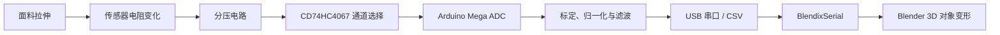

# HEXA-S · 智能面料拉伸数据可视化模块

[中文教程](README.zh.md) | [English Tutorial](README.md)

**Adaptive Smart Textile Care**

HEXA-S 是一个智能面料数据可视化原型。缝制或绣制在面料上的拉伸传感器会随面料形变改电阻，Arduino 通过电阻分压电路和模拟多路复用器读取各个感测点，再经 USB 串口将数据发送给 Blender。Blender 中的 3D 对象根据实时数据变形，用于展示面料不同区域的相对拉伸变化。

## 1. 系统、硬件与语言

### 软件环境

| 项目 | 说明 |
| --- | --- |
| 开发电脑 | Windows 10 |
| 嵌入式开发 | Arduino IDE，Arduino AVR Boards |
| 主控 | Arduino Mega 2560 |
| 3D 可视化 | Blender；建议使用 Blender 4.2 或更高版本配合新版扩展安装方式 |
| 串口接口 | [blendixserial Blender 扩展](https://electronicstree.com/blendixserial-addon/) |
| 固件语言 | Arduino C/C++ |
| Blender 扩展语言 | Python |
| 数据格式 | BlendixSerial CSV Fixed，115200 baud |

### 硬件清单

| 硬件 | 数量 | 用途 |
| --- | ---: | --- |
| Arduino Mega 2560 | 1 | 读取传感器并发送串口数据 |
| CD74HC4067 16 通道模拟多路复用器 | 1 | 用 1 个模拟输入读取多个传感器 |
| 拉伸传感器或导电线传感单元 | 6 起 | 感知面料的拉伸和回缩 |
| 固定电阻 | 每通道 1 个 | 与传感器构成分压电路 |
| 面包板或焊接洞洞板 | 1 | 原型连接或固定电路 |
| USB 数据线 | 1 | 上传固件、供电和串口通信 |
| 跳线、导线、线束固定件 | 若干 | 连接和应力释放 |
| 纺织基底、导电线/刺绣线 | 按设计 | 制作可穿戴感测结构 |

固定电阻不应直接照搬示意图。先用万用表测量传感器在静止和目标拉伸状态下的电阻，再选择与工作区间中值同一数量级的固定电阻。

## 2. 系统架构与功能



### 已实现的入门功能

- 轮询 CD74HC4067 的 6 个传感通道，可在代码中扩展到 16 个。
- 每个通道多次采样，使用指数移动平均减少抖动。
- 通过每个传感器的最小/最大值将数据归一化为 `0.0–1.0`。
- 将每个通道转换为一个 Blender 对象的 Scale Z，以约 20 Hz 的速率更新。
- 提供原始 ADC 输出模式，用于记录每个通道的标定区间。

## 3. 电路连通与组装

### Arduino Mega 与 CD74HC4067

| CD74HC4067 | Arduino Mega | 说明 |
| --- | --- | --- |
| VCC | 5V | 多路复用器供电；先确认所用模块的额定电压 |
| GND | GND | 共地 |
| S0 | D2 | 通道选择位 0 |
| S1 | D3 | 通道选择位 1 |
| S2 | D4 | 通道选择位 2 |
| S3 | D5 | 通道选择位 3 |
| SIG / COM | A0 | Arduino 模拟输入 |
| EN | GND | 低电平使能；如需程序控制可改接数字引脚 |

### 组装顺序

1. 断电状态下先在面包板上连接 1 个传感器和 1 个分压电阻。
2. 用万用表检查 5V 与 GND 间无短路，然后通电并确认 A0 的读数会随拉伸改变。
3. 接入 CD74HC4067，先验证 `C0`，再逐个增加传感通道。
4. 将传感器固定在面料设定区域。在导线与柔性面料的交界处增加应力释放，避免拉力集中在焊点。
5. 固定线束并保留面料的预定活动范围。确保导电路径不互相接触。
6. 最后连接 USB，进行逐通道标定和 Blender 联调。

## 4. 固件烧录与传感器标定

### 4.1 上传固件

1. 安装 [Arduino IDE](https://www.arduino.cc/en/software)。
2. 打开 `firmware/hexa_s_visualizer/hexa_s_visualizer.ino`。
3. 在 **Tools → Board** 中选择 **Arduino Mega or Mega 2560**，处理器选择 **ATmega2560**。
4. 用 USB 数据线连接主控，在 Windows 设备管理器中查看实际 `COM` 口，并在 **Tools → Port** 中选择它。
5. 检查固件顶部的引脚、`SENSOR_COUNT` 和波特率设置，然后点击 **Upload**。

### 4.2 标定每个通道

1. 把 `CALIBRATION_MODE` 改为 `true`，重新上传。
2. 打开 Serial Monitor，设为 `115200 baud`。
3. 在面料静置时记录每个通道的稳定读数；然后在设计允许的最大拉伸状态下再记录一次。
4. 将稍微留有余量的值写入 `CAL_MIN[]` 和 `CAL_MAX[]`。如果拉伸后的归一化结果方向相反，将对应的 `INVERT[]` 设为 `true`。
5. 把 `CALIBRATION_MODE` 改回 `false`，再次上传。
6. 关闭 Serial Monitor。同一个 COM 口通常不能同时被 Serial Monitor 和 Blender 占用。

面料、传感器固定方式、温度、湿度和反复拉伸都可能造成零点漂移。建议为每件样品保存独立的标定记录，并在重新缝合或更换传感器后重新标定。

## 5. Blender 运行教程

### 5.1 安装 BlendixSerial

1. 从 [BlendixSerial 扩展页](https://electronicstree.com/blendixserial-addon/) 下载 ZIP 包。
2. 打开 Blender，进入 **Edit → Preferences → Get Extensions**。
3. 点击右上角下拉菜单，选择 **Install from Disk**，安装 ZIP 文件。
4. 回到 3D Viewport，按 `N`，打开 **blendixserial** 面板。

### 5.2 建立六通道可视化

1. 在 Blender 中创建或导入 6 个对象，使其顺序与面料的 `C0–C5` 传感点一致。
2. 在需要的对象上执行 **Object → Apply → Scale**，确保初始缩放为 `1, 1, 1`。
3. 在 BlendixSerial 连接面板中选择 Arduino 的 `COM` 口，将 Baud Rate 设为 `115200`，然后点击 **Connect**。
4. 将 Mode 设为 **Receive**，Data Format 设为 **CSV (Fixed)**。
5. 按 `C0–C5` 顺序点击 **Add Object** 添加 6 个对象。在每行的设置中只启用 **Scale Z**。
6. 将 Update Scene 设置为与原型性能匹配的值，点击 **Start**。拉伸面料时，对应的 3D 单元应沿 Z 轴改变缩放。

## 6. 数据对应关系

固件每帧为每个传感器输出 9 个值，顺序遵循 BlendixSerial CSV Fixed 布局：

```text
Location X, Location Y, Location Z,
Rotation X, Rotation Y, Rotation Z,
Scale X,    Scale Y,    Scale Z
```

本项目仅改变第 9 个值 `Scale Z`。多个对象的数据按 Blender 面板中的对象列表顺序拼接，整帧以分号和换行结束。

```text
# 一个对象的示例：Scale Z = 1.375
0,0,0,0,0,0,1,1,1.375;
```

Blender 对象顺序、传感器通道顺序和面料物理位置必须使用同一份映射表。

## 7. 功能验证

| 检查 | 预期结果 |
| --- | --- |
| 单通道拉伸 | 只有对应 Blender 对象明显变化 |
| 回到静止状态 | 对象接近初始缩放，无持续大幅漂移 |
| 同时拉伸多个区域 | 多个对象按各自通道更新，映射不串位 |
| 连续运行 10 分钟 | 串口不中断，Blender 不持续累积延迟 |
| 断开 USB | Blender 停止更新，重连后可恢复 |
| 重复相同动作 | 曲线趋势基本一致；差异需记录并分析 |

## 8. 故障排查

| 问题 | 检查项 |
| --- | --- |
| 找不到 COM 口 | USB 线是否支持数据、驱动是否安装、设备管理器是否识别主控 |
| Blender 无法连接 | 关闭 Arduino Serial Monitor，确认 COM 口与波特率一致 |
| 对象不移动 | Mode 是否为 Receive、Data Format 是否为 CSV Fixed、是否点击 Start、Scale Z 是否启用 |
| 通道顺序错误 | 核对 `C0–C5`、`SENSOR_COUNT` 与 Blender 对象列表顺序 |
| 数值抖动 | 检查共地、焊点、长导线干扰，增加采样数或降低滤波系数 |
| 数值饱和在 0 或 1023 | 检查分压电路、传感器断路/短路、固定电阻选型 |
| 拉伸方向相反 | 调整对应通道的 `INVERT[]` |
| 更新卡顿 | 降低固件帧率、增大 Update Scene 间隔、减少对象数或面数 |

## 9. 参考资料

- [Arduino Project | 3D Temperature Gauge with Blender and Arduino](https://www.youtube.com/watch?v=f5dibcekHPs&list=PLNgvH2WAd8PjuhDG4desShaxqB3BjRXQl)：Arduino 传感数据进入 Blender 的参考演示。
- [BlendixSerial Blender Add-on](https://electronicstree.com/blendixserial-addon/)：扩展安装、连接面板、收发模式和通信格式说明。
- [blendixserial-arduino](https://github.com/electronicstree/blendixserial-arduino)：可选的 Arduino 端串口通信库。

本项目将通用的 Arduino–Blender 串口可视化方法应用于多通道智能面料原型。HEXA-S 的面料布局、传感器映射、标定数据和 3D 表达应作为项目自身内容单独记录。

## 许可证

为本项目选择开源许可证后，在仓库根目录添加 `LICENSE`。BlendixSerial Arduino 库使用 GPL-3.0；如果复制或修改其代码，需遵守上游许可证并保留归属。本仓库中的入门固件直接输出 CSV，未包含上游 Arduino 库副本，但仍应保留对 BlendixSerial 通信格式和教程的致谢。
