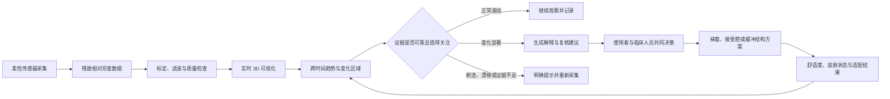

[中文](README.zh.md) | [English](README.md)

# HEXA-S

## 从残肢变化证据到假肢适配决策的智能织物系统

HEXA-S 将柔性拉伸传感器、可穿戴织物、实时数据处理与 3D 数字映射连接起来，持续记录残肢在一天中的体积与形态变化，为假肢技师提供静态扫描之外的时间维度证据。

> **核心闭环：采集 → 标定 → 可视化 → 比较 → 判断 → 建议 → 人工决策 → 结果记录**

[个人网站展示文档](docs/portfolio-case-study.zh.md) · [技术实现与复现指南](docs/technical/implementation-guide.zh.md) · [能力与成熟度](docs/product/capability-map.zh.md)

> **主视觉待补充**：优先展示使用者佩戴 HEXA-S、织物传感结构和实时 3D 模型同框的真实原型画面，而不是单独的产品渲染。

## 项目信息

| 项目 | 内容 |
| --- | --- |
| 项目类型 | 智能织物、可穿戴传感、假肢适配、医疗产品系统 |
| 核心问题 | 单次 3D 扫描无法反映残肢在一天中的动态体积变化 |
| 团队 | Yidan Nai、Neil Barnabas；University of the Arts London |
| 技术 | 刺绣拉伸传感器、Arduino Mega、CD74HC4067、串口数据、Blender / Grasshopper、TPU 3D 打印 |
| 当前状态 | 多通道织物传感与实时 3D 可视化原型已演示；长期佩戴、真实用户与临床决策价值仍待验证 |

## 为什么是 HEXA-S

假肢接受腔通常依据某一时刻的扫描或测量制作，但残肢会随活动、温度、液体变化和时间发生波动。一次准确的静态扫描，仍可能错过真正导致下午过紧、晚上过松或局部不适的变化模式。

HEXA-S 不把目标定义为“自动诊断”或“自动修改假肢”，而是把原本不可见、难以描述的身体变化转化为可回看、可比较、可讨论的证据：

1. **采集身体变化**：刺绣在织物上的柔性传感器记录不同区域的拉伸与回缩。
2. **形成可比较数据**：逐通道标定、归一化和滤波，将原始电阻变化转为相对形变量。
3. **建立空间映射**：传感点与 3D 模型区域保持一一对应，实时呈现变化位置。
4. **识别时间模式**：未来可比较不同时段、活动与佩戴条件下的趋势和异常。
5. **支持专业判断**：假肢技师结合身体数据、疼痛反馈和临床检查决定适配方案。
6. **记录结果**：调整后的舒适度、皮肤状态与后续变化进入下一轮评估。

## 当前流程的断点

| 方式 | 空间信息 | 时间信息 | 日常情境 | 支持临床决策 |
| --- | --- | --- | --- | --- |
| 单次 3D 扫描 | 强 | 无 | 弱 | 仅代表一个时刻 |
| 手工围度测量 | 粗略 | 依赖复测 | 弱 | 难定位局部变化 |
| 使用者口述 | 主观 | 可回忆 | 强 | 难以精确对应位置 |
| HEXA-S 目标 | 多区域相对变化 | 连续趋势 | 可关联活动与时间 | 作为辅助证据，由专业人员判断 |

## 从证据到决策的工作流

> 从采集到实时可视化已有原型支持；长期趋势、异常判断、适配建议与结果闭环属于后续设计和验证范围。

## 能力与成熟度

| 状态 | 能力 |
| --- | --- |
| **Demonstrated 已演示** | 柔性传感器电阻响应；多通道采集；逐通道标定、归一化与滤波；USB 串口传输；Blender 实时 3D 变形 |
| **Designed 已设计** | 传感质量提示；时间序列视图；变化区域比较；使用者症状记录；面向临床人员的证据摘要与共同决策流程 |
| **Future 未来能力** | 长期变化模式识别；正常波动与风险信号区分；可解释的适配建议；真实使用者验证；与响应式 TPU 缓冲结构联动 |

完整边界见 [HEXA-S 能力地图](docs/product/capability-map.zh.md)。

## 如果加入 AI，AI 应该做什么

AI 的价值不在于替代假肢技师，而在于帮助人从长期、多通道数据中发现值得复核的模式：

- 识别跨小时或跨天的重复变化，而不是把单次峰值直接解释为风险；
- 区分身体变化、正常活动和传感器漂移，低置信度时请求重新标定或补充信息；
- 用位置、时间、幅度、持续时长和数据质量解释结果；
- 将预测输出转化为“继续观察 / 补充记录 / 联系临床人员”的分级建议；
- 保留使用者与临床人员的确认、修改、拒绝和接管权。

任何健康风险提示都只能作为辅助判断，不能单独构成诊断或自动改变接受腔的依据。详细规则见 [临床 AI 协同原则](design-assets/ai-patterns/clinical-decision-principles.zh.md)。

## 原型与证据

当前仓库可复现的技术路径包括：

- Arduino Mega 与 CD74HC4067 轮询 6 个传感通道，可扩展至 16 通道；
- 多次 ADC 采样与指数移动平均降低抖动；
- 按传感器独立最小值和最大值归一化为 `0.0–1.0`；
- 以约 20 Hz 输出 BlendixSerial CSV Fixed 数据；
- 将通道映射到 Blender 对象的 `Scale Z`，实时显示相对拉伸；
- 原始 ADC 模式支持传感器标定。

现阶段尚不能声称：系统已准确测得临床尺寸、已验证长期佩戴可靠性、能够诊断健康风险、已经生成临床认可的接受腔方案，或能自动驱动自适应结构。

## 验证重点

1. **传感可靠性**：重复拉伸、迟滞、漂移、温湿度、洗涤与穿脱。
2. **空间与尺寸有效性**：相对电阻变化能否稳定对应位置与几何变化。
3. **佩戴体验**：舒适度、压力点、走线、活动限制和长期耐用性。
4. **临床可用性**：信息是否帮助技师做出更一致的判断，而非增加无效数据与告警。

测试模板见 [验证框架](design-assets/evaluation/validation-scorecard.zh.md)，待补证据见 [发布素材清单](docs/materials-needed.zh.md)。

## 产品路线图

| 阶段 | 目标 | 核心验证 |
| --- | --- | --- |
| **Sense** | 稳定采集多个织物区域的相对形变 | 重复性、迟滞、漂移、通道串扰 |
| **Map** | 将数据映射到可理解的 3D 空间 | 通道—身体区域一致性、延迟、可读性 |
| **Understand** | 从时间序列中识别模式并解释证据 | 假阳性、低置信恢复、使用者理解度 |
| **Decide** | 支持使用者与技师共同选择下一步 | 临床可用性、决策一致性、人工接管 |
| **Adapt** | 研究可调或可更换的缓冲结构 | 安全性、舒适度和真实使用效果 |

## 技术实现与复现

- [中文技术实现与复现指南](docs/technical/implementation-guide.zh.md)
- [English technical tutorial](README.md)
- [Arduino 固件](firmware/hexa_s_visualizer/hexa_s_visualizer.ino)

## 项目边界

本项目目前是设计与工程原型，不是获批医疗器械。任何面向真实使用者的测试都应经过适当的伦理、同意、隐私、安全与临床监督流程。
